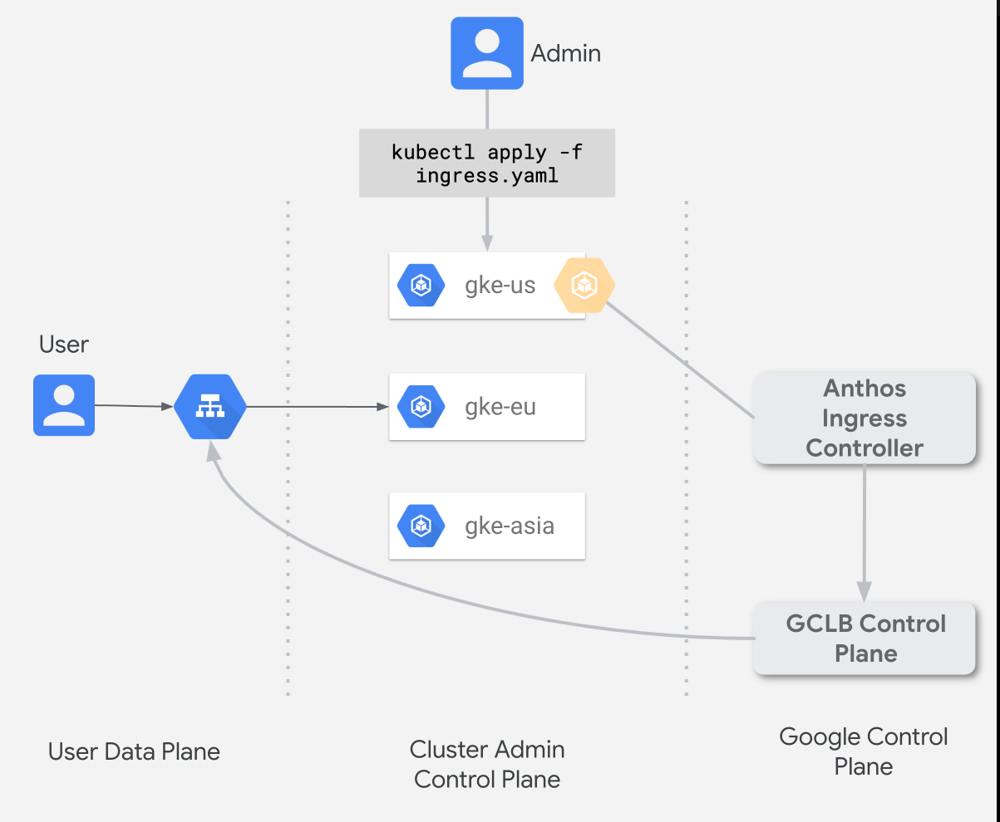

summary: Ingress for Anthos Lab
id: anthos-ingress-lab
categories: cloud
tag: anthos
status: Published
authors: Vinesh
Feedback Link: https://codelabs.devnull.fyi

# 204 - Deploying Ingress across multiple clusters

<!-- ---------------------------------------------------------------------------- -->
## Overview

Duration: 4

Ingress for Anthos (Ingress) is a cloud-hosted multi-cluster ingress controller for Anthos GKE clusters. It's a Google-hosted service that supports deploying shared load balancing resources across clusters and across regions.

In this lab you will install Ingress for Anthos across multiple GKE clusters in your environment.

An overview of Ingress for anthos is outlined [here](https://cloud.google.com/kubernetes-engine/docs/concepts/ingress-for-anthos).

<!-- ---------------------------------------------------------------------------- -->
## Setting up Ingress for Anthos

Duration: 10

You would need 2 GKE clusters to complete this lab. Set-up two GKE clusters in 2 different regions (e.g. us-west1 & europe-west-1).

Instructions on how to set-up an environment for Ingress for Anthos can be found [here](https://cloud.google.com/kubernetes-engine/docs/how-to/ingress-for-anthos-setup).

> For this lab We won't need to follow the [Shared VPC instructions](https://cloud.google.com/kubernetes-engine/docs/how-to/ingress-for-anthos-setup#shared_vpc_deployment).

<!-- ---------------------------------------------------------------------------- -->
## Deploying Ingress across clusters

Duration: 15

you will deploy a fictional app named zoneprinter and Ingress for Anthos in two clusters. The Ingress provides a shared virtual IP (VIP) address for the app deployments.

This page builds upon the work done in Setting up Ingress for Anthos, where you created and registered two clusters.

Instructions for this activity can be found [here](https://cloud.google.com/kubernetes-engine/docs/how-to/ingress-for-anthos).

<!-- ---------------------------------------------------------------------------- -->
## Having Trouble

Duration: 1

These labs are new for Q2 '20, and you may hit a roadblock or a bug. If this happens, email the labs Google Group - [hybrid-sme-labs-2020@google.com](mailto:hybrid-sme-labs-2020@google.com), and a lab owner will be in touch to help.
