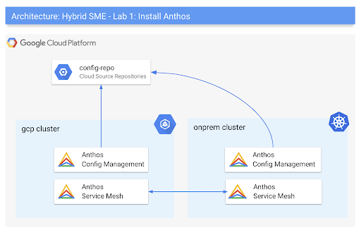
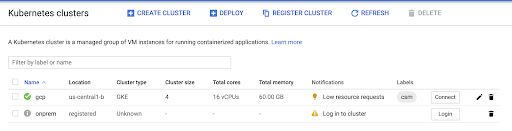
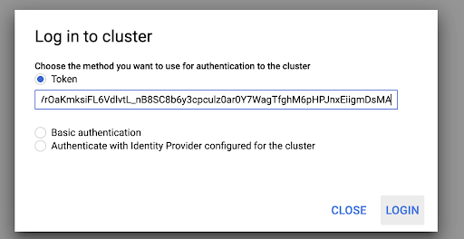
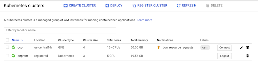
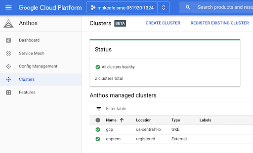
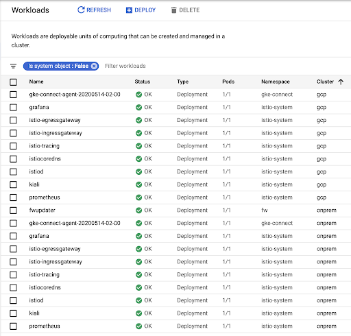
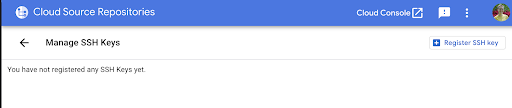
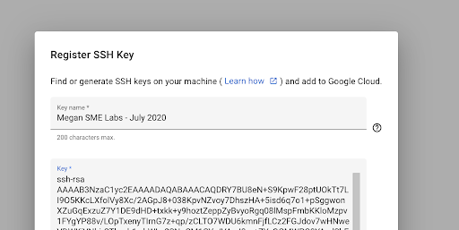
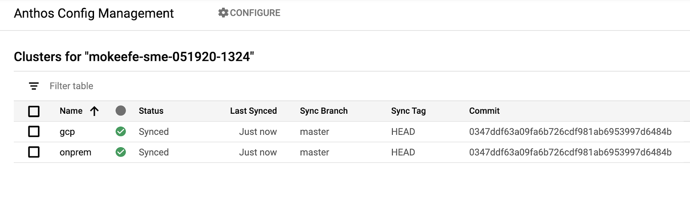

summary: Anthos Installation
id: anthos-install
categories: cloud
tag: anthos
status: Published
authors: Vinesh
Feedback Link: http://mvpzone.org

# 102 - Install Anthos

<!-- ---------------------------------------------------------------------------- -->
## Introduction

Duration: 2

Welcome to the Anthos Workshop labs! Over the course of these labs, you will learn & explore how Anthos can help  manage hybrid cloud environments with a consistent set of deployment environments and tools.

This first lab covers Anthos installation - creating multiple GKE clusters, then installing the Anthos components on those clusters. (We'll cover app deployments in the next lab.)  

> Throughout these labs, we will consider various tasks from the perpspective of various personna's. While each lab includes technical steps for installing, operating, and securing an Anthos environment, it's likely that within an  organization, these tasks will be segmented and divided amongst different roles.

### What Lab 1 covers

- Simple Anthos installation over multiple GKE clusters
- Creating 2 GKE clusters
- Installation of Anthos components on these clusters

> We'll cover app deployments in the next lab.

### Anthos Topology

By the end of Lab 1, you will have your own GCP project with the following Anthos setup:



> Because this lab takes you through Anthos and GKE installation, this lab falls into the Platform Engineer role.

<!-- ---------------------------------------------------------------------------- -->
## Prerequisites

Duration: 2

These following prerequisites apply to this and all subsequent Anthos workshop Labs.

- A GCP user account with the ability to create Projects.
- Join the lab discussion Google Group. You can use this Google Group to report problems with these labs, and ask questions.
- Install the [SnipIt Google Chrome extension](https://chrome.google.com/webstore/detail/snipit/ehoadneljpdggcbbknedodolkkjodefl). You will use this tool to screenshot your lab progress, and mark completion.

<!-- ---------------------------------------------------------------------------- -->
## Prepare Your Environment

Duration: 15

- [ ] Open Cloud Console - log into your user account if you are not already logged in.
- [ ] Open the Cloud Shell terminal by clicking on the shell icon at the top-right of the screen.
- [ ] From Cloud Shell, click cmd + or ctrl + to zoom in so that you can comfortably read the terminal text.
- [ ] From Cloud Shell, copy and paste the following commands to create a GCP project.

> For the rest of the labs, anytime you see a black box like this, you should copy and paste the commands into your Cloud Shell terminal.

```shell
export DATE=`date +"%m%d%y-%H%M"`
export PROJECT_ID="${USER}-sme-${DATE}"
gcloud projects create ${PROJECT_ID}
gcloud config set project ${PROJECT_ID}
```

> Take note of your new project ID (<your-user>-sme-<timestamp>) and store it somewhere safe. You will use this same project throughout all the workshop labs.

- [ ] Set your billing account as BILLING_ID. Your billing ID can be found by navigating to GCP > choosing google.com as the org, In the hamburger menu navigate to the billing console and taking note of your Billing Account ID.

```shell
export BILLING_ID="<your-id>"
```

- [ ] Connect your new GCP project to your billing account.

```shell
gcloud alpha billing projects link $PROJECT_ID --billing-account $BILLING_ID
```

- [ ] Clone the workshop repo, and navigate to the "install" directory.

```shell
cd $HOME; mkdir -p hybrid-sme; cd hybrid-sme;
export ROOT=$HOME/hybrid-sme;
git clone https://github.com/GoogleCloudPlatform/bank-of-anthos-scripts; cd bank-of-anthos-scripts/install/
```

- [ ] Generate a new ssh key. You will use this key to authenticate Anthos Config Management with your Cloud Source Repositories.

```shell
GCLOUD_ACCOUNT=$(gcloud config get-value account)

ssh-keygen -t rsa -b 4096 \
-C "$GCLOUD_ACCOUNT" \
-N '' \
-f $HOME/.ssh/id_rsa.sme
```

> If your instructor indicates that the project has been already set-up for you in your environment you can skip this step.

<!-- ---------------------------------------------------------------------------- -->

## Install Anthos

Duration: 45

### Run the bootstrap script

This script provisions the clusters, installs multicluster Istio, and pre-installs the Anthos Config Management operator.

> **Note:** this script takes ~10 minutes to run.

```shell
cd $ROOT/bank-of-anthos-scripts/install
source ./env
./bootstrap.sh
```

This script deploys the following into your project:

- 1 GKE cluster running in GCP
- 1 simulated on-premises Kubernetes cluster ([Kops](https://github.com/kubernetes/kops) on Google Compute Engine). You will register this cluster to Anthos as if it were running on prem.
  - _**Note**_ - Kops is not a supported "Bring your own cluster" (BYOK8s) environment.
  - We include Kops only for ease of demo purposes, and to demonstrate registering and operating a non-GKE Kubernetes cluster using Anthos.
  - You would follow a similar process for registering and managing GKE On Prem clusters.
- [GKE Connect](https://cloud.google.com/anthos/multicluster-management/connect) installed on both the Kops cluster and the regular GKE cluster. This registers the clusters to the Anthos dashboard in addition to the GKE dashboard.
- A Cloud Source Repository, config-repo - you will store our Anthos policies here later. 
- [Anthos Config Management](https://cloud.google.com/anthos-config-management/docs/overview) (**ACM**) - this "syncer" runs inside both clusters. it watches config-repo for any policy changes, and enforces those policies across both clusters.
- [Istio](https://istio.io/docs/concepts/what-is-istio/) (Service Mesh) installed on both clusters and configured for multicluster. Service Mesh handles cross-cluster Kubernetes networking between pods, allowing services in one cluster to reach services in another cluster using kubernetes DNS. Service Mesh can also generate app-level telemetry with no code changes, customize traffic routing, enforce security policies at runtime. Later, you'll explore how Service Mesh helps unify hybrid Kubernetes environments.
  - These labs use open-source Istio instead of the bundled Anthos Service Mesh (ASM). This is because as of July 2020, ASM hybrid multicluster mesh support is not yet GA.

> **Note:** While this first iteration of the Anthos workshop labs only covers the three core Anthos subproducts: GKE, ACM, and ASM (plus Cloud Build), know that [Anthos has more integrations](https://cloud.google.com/anthos#section-5) than what is covered in these labs.

When the script successfully completes, you should see a Kubernetes Service Account (KSA) token printed to stdout. Copy the token by simply selecting the text - a scissors icon will appear. Do not use CTRL-C or CMD-C.

```shell
#Example output - do not copy

eyJhbGciOiJSUzI1NiIsImtpZCI6InBXYTVfWGdBUGJlVUR6emxaaXlkMmJHcVI4WlMtb3N0RDhTSmdWcENVUFkifQ.eyJpc3MiOiJrdWJlcm5ldGVzL3NlcnZpY2VhY2NvdW50Iiwia3ViZXJuZXRlcy5pby9zZXJ2aWNlY....
```

**Note:** In case you did not proceed to the next step immediately, you can use the following command to retrieve the token:

```shell
printf "\n$(kubectl --kubeconfig=$ONPREM_KUBECONFIG describe secret $KSA | sed -ne 's/^token: *//p')\n\n"
```

### Log into the remote cluster

In the Cloud Console, navigate to **Kubernetes Engine**.  You should see two clusters - gcp and onprem. Next to the onprem cluster, you should see a warning icon, and a message: "Log in to cluster."



Next to the onprem cluster, click "Login," then select "Token" as the login method. Paste the token you copied from Cloud Shell and click "log in."



You should then see a green checkmark next to the onprem cluster, indicating that you have successfully logged in. Notice how the Cluster Type for the onprem cluster is "Kubernetes". This indicates that the onprem cluster is not GKE, but rather an open-source Kubernetes cluster we've registered to GCP as if it were a GKE cluster.



### Explore clusters

View the two registered Anthos clusters in the Anthos dashboard.
In the left Console sidebar, click Anthos > Clusters. You should see both clusters in the table - including the "registered" onprem cluster, and a message: "all clusters healthy."



### Explore cluster workloads

View Kubernetes workloads across clusters by navigating to Kubernetes Engine > **Workloads**. View running workloads for both the onprem and gcp clusters. You should see workloads for **gke-connect** and **Istio (Service mesh)**.



<!-- ---------------------------------------------------------------------------- -->

## Set up Anthos Config Management

Duration: 30

**Anthos Config Management (ACM)** is an agent running inside an Anthos cluster that "syncs" YAML configuration from a git repository. We'll use ACM later to unify configuration & policy governance across the two clusters.  By default, ACM requires that your config repository is structured in a specific way to allow for hierarchical policy at the cluster and Kubernetes namespace-level.  In this task, you'll set up the ACM configuration repo that will be synced to your two Anthos clusters.

### Enable ACM in the Cloud Console.

```shell
gcloud alpha container hub config-management enable
```

### Create ACM config repository

Create a new Cloud Source repo called config-repo, clone to cloud shell, and initialize the repo structure. This will be the Git source of truth for config and policies synced across both clusters, through Anthos Config Management.

```shell
export PROJECT=$(gcloud config get-value project)
export GCLOUD_ACCOUNT=$(gcloud config get-value account)
export REPO_URL=https://source.developers.google.com/p/${PROJECT}/r/config-repo
export ROOT=$HOME/hybrid-sme;

git config credential.helper gcloud.sh
gcloud source repos create config-repo
cd $ROOT
gcloud source repos clone config-repo
cd $ROOT/config-repo

cp -r $ROOT/bank-of-anthos-scripts/install/acm/config-repo-source/* .
```

```shell
#Output - do not copy

Cloning into '/home/mokeefe/hybrid-sme/config-repo'...
warning: You appear to have cloned an empty repository.
Project [mokeefe-sme-070620-1410] repository [config-repo] was cloned to [/home/mokeefe/hybrid-sme/config-repo].
```

View the local contents of your config-repo. This directory structure is required by default in Anthos Config Management. Each sub-directory has a different purpose. For instance, we will create a directory under "namespaces," called "boa," which adds the namespace into which we'll deploy an application in Lab 2.

```shell
tree $ROOT/config-repo
```

```shell
#Output - do not copy

/home/mokeefe/hybrid-sme/config-repo
├── cluster
│   └── README.md
├── clusterregistry
│   ├── clusters.yaml
│   └── selectors.yaml
├── namespaces
│   ├── boa
│   │   └── namespace.yaml
│   └── README.md
└── system
    └── repo.yaml

5 directories, 6 files

```

Set your git credentials.

```shell
git config --global user.email ${USER}@"your domain"
git config --global user.name ${USER}
```

Push the contents of config-repo to Cloud Source Repositories.

```shell
cd $ROOT/config-repo
git add .
git commit -m "Initialize config-repo"
git push -u origin master
```

```shell
Output - do not copy

Enumerating objects: 13, done.
Counting objects: 100% (13/13), done.
Delta compression using up to 2 threads
Compressing objects: 100% (10/10), done.
Writing objects: 100% (13/13), 1.48 KiB | 757.00 KiB/s, done.
Total 13 (delta 3), reused 0 (delta 0)
remote: Resolving deltas: 100% (3/3)
To https://source.developers.google.com/p/mokeefe-sme-070620-1410/r/config-repo
 * [new branch]      master -> master
Branch 'master' set up to track remote branch 'master' from 'origin'.

```

### Give ACM access to config-repo

Allow ACM to view the repo, by mounting an ssh key as a secret into both clusters.
Throughout these labs, you will use the kubectx tool which allows you to easily switch between different Kubernetes cluster contexts.

```shell
kubectx gcp
kubectl create secret generic git-creds \
--namespace=config-management-system \
--from-file=ssh=$HOME/.ssh/id_rsa.sme

kubectx onprem
kubectl create secret generic git-creds \
--namespace=config-management-system \
--from-file=ssh=$HOME/.ssh/id_rsa.sme
```

Copy the ssh key to your clipboard by selecting the text until a scissors icon appears. do not use cmd-c to copy.

```shell
cat $HOME/.ssh/id_rsa.sme.pub
```

In a new browser tab, navigate to: [https://source.cloud.google.com/user/ssh_keys](https://source.cloud.google.com/user/ssh_keys), then click “Register SSH key”



Name the key anything you'd like - then paste the key, starting with “ssh-rsa”, you just copied. Then click "Register"  
> **Note:** this key is registered to your GCP account, not your project.



### Configure config sync agent on both clusters

Configure the config sync agent on both clusters, to watch your new config-repo.

```shell

export BASE_DIR="$ROOT/bank-of-anthos-scripts/install"
export ONPREM=onprem
export GCP=gcp
REPO_URL=ssh://${GCLOUD_ACCOUNT}@source.developers.google.com:2022/p/${PROJECT}/r/config-repo

kubectx $ONPREM
cat $BASE_DIR/acm/config_sync.yaml | \
  sed 's|<REPO_URL>|'"$REPO_URL"'|g' | \
  sed 's|<CLUSTER_NAME>|'"$ONPREM"'|g' | \
  sed 's|none|ssh|g' | \
  kubectl apply -f - 

kubectx $GCP
cat $BASE_DIR/acm/config_sync.yaml | \
  sed 's|<REPO_URL>|'"$REPO_URL"'|g' | \
  sed 's|<CLUSTER_NAME>|'"$GCP"'|g' | \
  sed 's|none|ssh|g' | \
  kubectl apply -f -
```

```shell
#Output - do not copy

configmanagement.configmanagement.gke.io/config-management created
```

### Validate ACM status

The "[nomos](https://cloud.google.com/anthos-config-management/docs/how-to/nomos-command)" command-line tool checks each cluster's ACM sync status against the config repo. `nomos status` tells you what Git commit token each cluster is synced to.

The nomos command was installed to your environment when the bootstrap script ran in Task 3. If you want to manually install nomos to your local environment, you can [download it here](https://cloud.google.com/anthos-config-management/downloads#nomos_command).

```shell
watch nomos status
```

Within a few minutes, you should see the git sync status move from UNKNOWN, to PENDING, to SYNCED.  You may also see an "ERROR" status for the first few minutes (no endpoints available for service "gatekeeper-webhook-service") - this is normal, and indicates that the ACM pods are still starting up.

You should eventually see a **SYNCED** status for both clusters. The "Last Synced Token" is the git commit ID for the config-repo git push you just did.  

```shell
#Output - do not copy

Connecting to clusters...
Current   Context   Status           Last Synced Token   Sync Branch
-------   -------   ------           -----------------   -----------
          gcp       SYNCED           71cbe02a            master
*         onprem    SYNCED           71cbe02a            master

```

View the ACM status in the Cloud Console

This is another way to view the git sync status. Navigate to Anthos > Config Management. This table displays the same status you would see if you ran `nomos status`.



### Validate ACM Namespace

Get namespaces on both clusters.

You should see a new namespace, called boa ("Bank of Anthos") synced to both clusters via ACM. "boa" is the application namespace you will use in this training, centrally administered with ACM. In the next lab, you will use Cloud Build to deploy a sample application into the "boa" namespace on both clusters - then later, you'll use ACM to enforce policies for the developers deploying into this namespace.

```shell

kubectx gcp
kubectl get ns
kubectx onprem
kubectl get ns

```

```shell

#Output - do not copy

NAME                       STATUS   AGE
config-management-system   Active   50m
default                    Active   52m
boa                        Active   38s
...
```

<!-- ---------------------------------------------------------------------------- -->
## Lab Completion

Duration: 2

Congratulations! You just installed the core Anthos components on your GCP project. Now you're ready to deploy an application onto your simulated hybrid cloud environment.

<!-- ---------------------------------------------------------------------------- -->
## Learn More

Duration: 2

- [Multicluster Kubernetes Use Cases](https://cloud.google.com/anthos/multicluster-management/use-cases)
- [Anthos technical overview](https://cloud.google.com/anthos/docs/concepts/overview)
- [Anthos Environs](https://cloud.google.com/anthos/multicluster-management/environs) 
  - _not used in these labs - a logical grouping of clusters + resources_
- eBook - [Anthos Under the Hood (2020)](https://inthecloud.withgoogle.com/content-anthos/dl-cd.html)
- GKE on GCP - Tutorial - [Explore Anthos (Sample Deployment - 2 GKE on GCP clusters)](https://cloud.google.com/anthos/docs/tutorials/explore-anthos)
- [Anthos Config Management docs](https://cloud.google.com/anthos-config-management/docs)

<!-- ---------------------------------------------------------------------------- -->
## Appendix - Reconnecting to Labs

Duration: 2

If you have to pause this lab and return to it later - or if your Cloud Shell becomes disconnected, re-open or refresh the Cloud Shell page. Once you are connected, execute the following commands:

```shell
export PROJECT_ID=<your-sme-project-id>
gcloud config set project $PROJECT_ID

cd $HOME/hybrid-sme/bank-of-anthos-scripts/install
source ./env
source ./common/install-tools.sh
```
