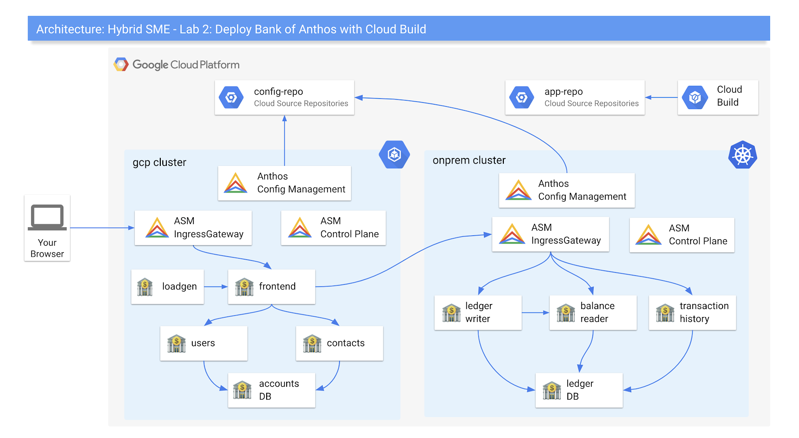

summary: Anthos Labs
id: anthos-lab
categories: cloud
tag: anthos
status: Published
authors: Vinesh
Feedback Link: http://mvpzone.org

# 101 - Anthos Workshop Lab

<!-- ---------------------------------------------------------------------------- -->
## Contents

Duration: 5

Welcome to the Anthos Workshop labs! Over the course of these labs, you will learn & explore how Anthos can help  manage hybrid cloud environments with a consistent set of deployment environments and tools.

Lab | Title | Completion Form
---------|----------|---------
 1 | [Install Anthos](/codelabs/install-anthos/index.html) | [go/sme-form-1](go/sme-form-1)
 2 | [Deploy an Application to Anthos with Cloud Build](https://docs.google.com/document/d/1M09e5krI22PeFJ31_906uno_180XuHeBjGsOJ8CkEj0/edit?usp=sharing) | [go/sme-form-2](go/sme-form-2)
 3 | [Observability with Cloud Operations and Service Mesh](https://docs.google.com/document/d/1plbuAD42hAdSGLY5exl6_sYQYz-C9m7l8ib6u8qhYXY/edit?usp=sharing) | [go/sme-form-3](go/sme-form-3)
 4 | [Safe Application Rollouts with Service Mesh](https://docs.google.com/document/d/1yNma6NXRD8quwI5e7lr1c8pBE03i5FKHn_PYPEH14cw/edit?usp=sharing) | [go/sme-form-4](go/sme-form-4)
 5 | [Secure Your Anthos Environment with Config Management](https://docs.google.com/document/d/1TOra4JzYhdDgMThf4UTEXhtImfjbPimQVLdgHa7ika4/edit?usp=sharing) | [go/sme-form-5](go/sme-form-5)
 6 | [Validate and Test Anthos Configuration](https://docs.google.com/document/d/1KUb75l-2I9sf51LgdpvOdaWkso7xO97NfP1iVt75THQ/edit?usp=sharing) | [go/sme-form-6](go/sme-form-6)
 7 | [Secure the Software Supply Chain with Binary Authorization](https://docs.google.com/document/d/1H6OZbsNmXUEo_CSn6WblzXlwCvJ0FR578uDWwIuzK2c/edit?usp=sharing) | [go/sme-form-7](go/sme-form-7)

### Architecture



**NOTE:** As of June 2020, these labs use open-source Istio 1.6.2 and not managed Anthos Service Mesh (ASM). This is because ASM does not yet support multiple clusters (and multi-cluster with non-GKE on GCP) as of mid June 2020. We plan to upgrade these labs to ASM as soon ASM multicluster is publicly available and we have validated the labs with ASM.

<!-- ---------------------------------------------------------------------------- -->
## Reconnecting to your environment

Duration: 2

If you return to these labs later, your laptop goes to sleep, or your Cloud Shell is spontaneously disconnected, run the following commands:

```shell
export PROJECT_ID=<your-sme-project-id>
gcloud config set project $PROJECT_ID

cd $HOME/hybrid-sme/bank-of-anthos-scripts/install
source ./env
source ./common/install-tools.sh
```

<!-- ---------------------------------------------------------------------------- -->
## Having Trouble

Duration: 1

These labs are new for Q3 '20, and you may hit a roadblock or a bug. If this happens, email the labs Google Group - [hybrid-sme-labs-2020@google.com](mailto:hybrid-sme-labs-2020@google.com), and a lab owner will be in touch to help.

Congratulations! You just installed the core Anthos components on your GCP project. Now you're ready to deploy an application onto your simulated hybrid cloud environment.

<!-- ---------------------------------------------------------------------------- -->
## Cleanup

Duration: 2

To clean up your Anthos environment (clusters, firewall rules) but keep your GCP project intact, run the following script:

```shell
cd ${HOME}/hybrid-sme/bank-of-anthos-scripts/install
./cleanup.sh
```
