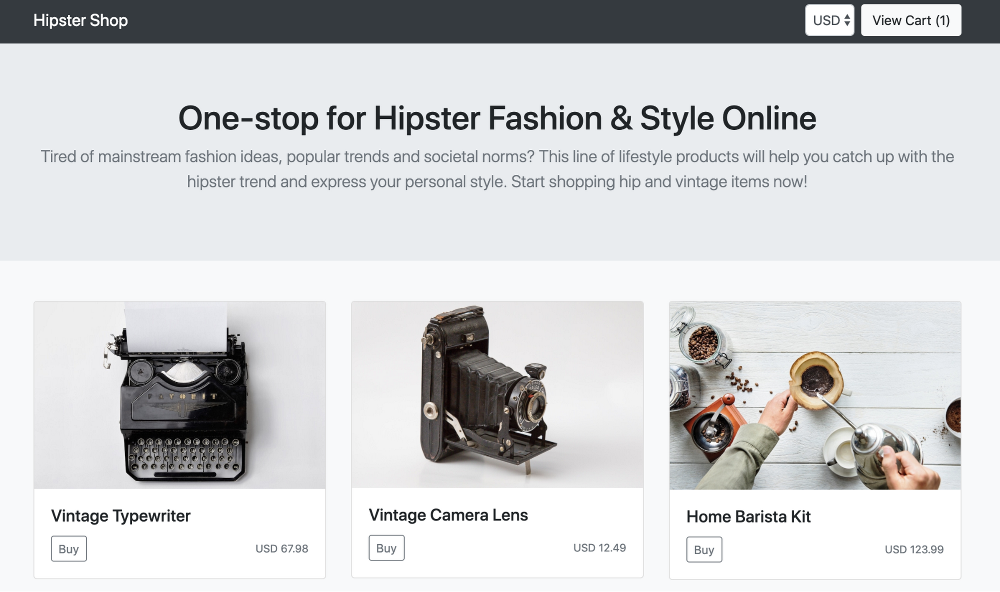
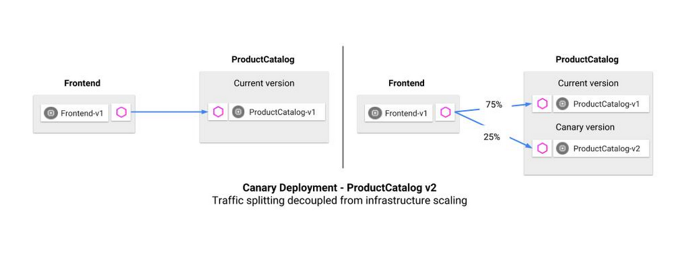

summary: ASM Lab Canary Deploy
id: asm-canary-lab
categories: cloud
tag: anthos
status: Published
authors: Vinesh
Feedback Link: https://codelabs.devnull.fyi

# 203 - Online Boutique application Canary Deployment

<!-- ---------------------------------------------------------------------------- -->
## Deploying the Online Boutique application on ASM

Duration: 2

In this activity you will install the Online Boutique sample application to explore capablities of Anthos Service Mesh.

The activties to be performed are outlined [here](https://cloud.google.com/service-mesh/docs/onlineboutique-install-kpt).

Online Boutique is a cloud-native microservices demo application. Online Boutique consists of a 10-tier microservices application. The application is a web-based e-commerce app where users can browse items, add them to the cart, and purchase them. You can find more details about the online boutique application in the following [github repo](https://github.com/GoogleCloudPlatform/microservices-demo)

<!-- ---------------------------------------------------------------------------- -->
## Canary Deployment

Duration: 15

### Overview

In this lab you will explore application deployments and traffic management with ASM. We will also notice how ASM is compatible with Istio.

While this online boutique app has multiple components, we'll focus on Product Catalog, which serves the list of products above. We will run through a traffic routing example, using a [canary](https://istio.io/docs/concepts/traffic-management/#splitting-traffic-between-versions) deployment.

A canary deployment routes a small percentage of traffic to a new version of a microservice, then allows you to gradually roll it out to the whole user base, while phasing out and retiring the old version. If something goes wrong during this process, traffic can be switched back to the old version.

We create a new version of the ProductCatalog microservice. The new version ("v2") is deployed to Kubernetes alongside the working ("v1") deployment.

Then, we create an Istio VirtualService (traffic rule) that sends 25% of ProductCatalog traffic to v2. We can deploy this rule to the Kubernetes cluster, alongside our application. With this policy, no matter how much production traffic goes to ProductCatalog—and how many pods scale up as a result—Istio ensures that the right percentage of traffic goes to the specified version of ProductCatalog.

### Canary Deployment

The activties to be performed are outlined [here](https://github.com/mvpzone/istio-samples/tree/master/istio-canary-gke).

**Note:** The instructions in the repo are based on Istio and equally apply to our ASM environment too.

> We have already completed the pre-requsites of setting up a GKE cluster and installing ASM. So we only need to start from the step requiring us to [deploy the v2 of product catalogue](https://github.com/mvpzone/istio-samples/tree/master/istio-canary-gke#deploy-productcatalog-v2)

<!-- ---------------------------------------------------------------------------- -->
## Canary Rollback

Duration: 12

In this activity we will troubeshoot the canary deployment and perform a roll-back of the deployment. The product catalogue v2 has a three-second latency injected into all requests.

> We skip the [Kiali activity](https://github.com/mvpzone/istio-samples/tree/master/istio-canary-gke#view-traffic-splitting-in-kiali) since we will use Anthos Service Mesh UI instead.

Once the v2 canary version is deployed, we can explore using the Anthos Service Mesh UI to see how ProductCatalog v2 is performing. Notice that we are looking at the Response Latency metric, this tells us the time it takes for each service to respond to requests.

Here, we can see ProductCatalog v2's injected three-second latency. From here, it's easy to roll back from v2 to v1. We can do this by updating the Istio VirtualService to return 100% of traffic to v1, then deleting the v2 Kubernetes deployment.

Instructions to perform a rollback of the canary is outlined [here](https://github.com/mvpzone/istio-samples/tree/master/istio-canary-gke#rollback).

**Note:** Skip the [cleanup step](https://github.com/mvpzone/istio-samples/tree/master/istio-canary-gke#cleanup) since we will be reusing this deployment for further labs.

<!-- ---------------------------------------------------------------------------- -->
## Having Trouble

Duration: 1

These labs are new for Q2 '20, and you may hit a roadblock or a bug. If this happens, email the labs Google Group - [hybrid-sme-labs-2020@google.com](mailto:hybrid-sme-labs-2020@google.com), and a lab owner will be in touch to help.
