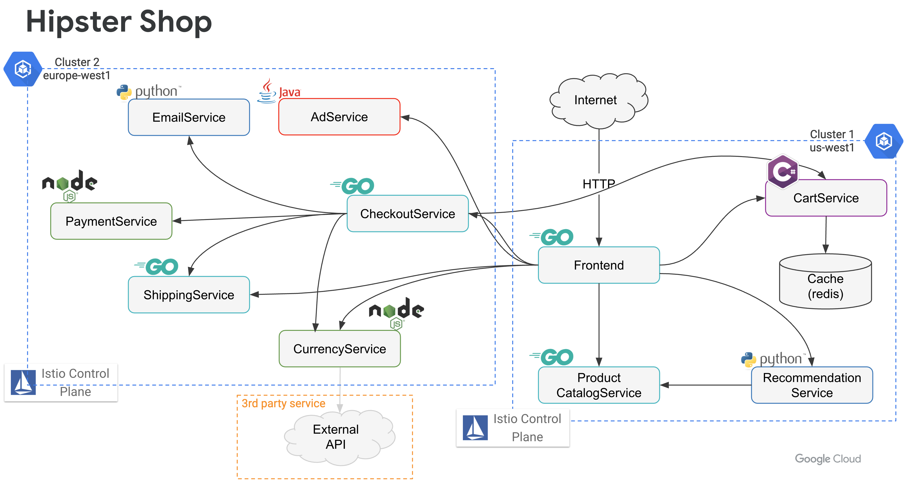

summary: Anthos Service Mesh Lab
id: asm-lab
categories: cloud
tag: anthos
status: Published
authors: Vinesh
Feedback Link: https://codelabs.devnull.fyi

# 201 - Anthos Service Mesh Lab

<!-- ---------------------------------------------------------------------------- -->
## Overview

Duration: 5

Welcome to the Anthos Service Mesh labs!

Over the course of these labs, you will learn & explore how Anthos Service Mesh (ASM) can help support modern cloud application deployments through the following tasks.

Lab | Title
---------|----------
 1 | [Setup a new GKE cluster](https://cloud.google.com/service-mesh/docs/gke-cluster-setup#setting_up_new_cluster)
 2 | [Install Anthos Service Mesh](https://cloud.google.com/service-mesh/docs/gke-install-asm)
 3 | [Deploy a Sample Application](https://cloud.google.com/service-mesh/docs/onlineboutique-install-kpt)
 4 | [Execute Safe Application Rollouts](https://github.com/mvpzone/istio-samples/tree/master/istio-canary-gke)
 5 | [Install Anthos Global Ingress](https://cloud.google.com/kubernetes-engine/docs/how-to/ingress-for-anthos-setup)
 6 | [Deploy a global Application](https://cloud.google.com/kubernetes-engine/docs/how-to/ingress-for-anthos)
 7 | [Configure Cross cluster service discovery](https://cloud.google.com/service-mesh/docs/gke-install-multi-cluster)
 8 | [Deploy a Multi-Cluster Application](https://github.com/mvpzone/hipster/tree/master/mcrcp)
 9 | [Deploy a Marketplace Kubernetes Application](https://cloud.google.com/marketplace/docs/kubernetes-apps)

### Architecture

You will be using the [online boutique demo application](https://github.com/GoogleCloudPlatform/microservices-demo.git) for most of the labs. Our final deployment architecture will be as follows.



**NOTE:** As of Aug 2020, these labs use Anthos Service Mesh (ASM) 1.6.4-asm.9.

<!-- ---------------------------------------------------------------------------- -->
## Lab Pre-requisites

Duration: 5

To complete these labs an Anthos entitled service account is required, if you wish to execute these labs in your environments. Your hosts can provide instructions on how to get access to an entitled account. You can self-provision an entitled account by launching the [Anthos sample deployment](https://console.cloud.google.com/marketplace/details/click-to-deploy-images/anthos-sample-deployment?_ga=2.89271251.912462658.1596769275-1489993943.1594165045) in your environment.

You can find a summary of how to explore Anthos in your environment [here](https://cloud.google.com/anthos/docs/tutorials/explore-anthos).

<!-- ---------------------------------------------------------------------------- -->
## Environment Set-up

Duration: 3

There are various options to set-up your environment to work through the labs.

* Use Cloud Shell
* Use Command line tools installed locally

You can find a summary of how to prepare your environment [here](https://cloud.google.com/service-mesh/docs/environment-setup).

Congratulations! Now you're ready to deploy an application onto your simulated global cloud environment.

<!-- ---------------------------------------------------------------------------- -->
## Reconnecting to your environment

Duration: 1

If you return to these labs later, your laptop goes to sleep, or your Cloud Shell is spontaneously disconnected, run the following commands:

```shell
export PROJECT_ID=<your-project-id>
gcloud config set project $PROJECT_ID

cd $HOME
```

<!-- ---------------------------------------------------------------------------- -->
## Having Trouble

Duration: 1

These labs are new for Q2 '20, and you may hit a roadblock or a bug. If this happens, email the labs Google Group - [hybrid-sme-labs-2020@google.com](mailto:hybrid-sme-labs-2020@google.com), and a lab owner will be in touch to help.
